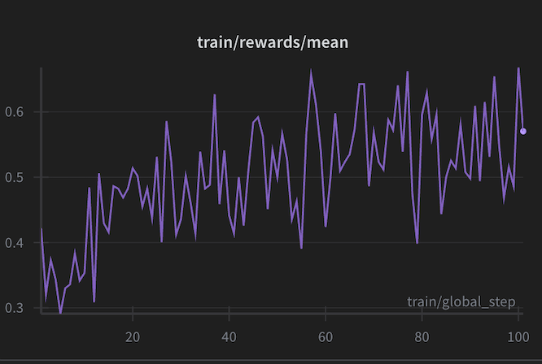

# History of RLVR


## Why this repo exists

Over the past year, I found myself going deep on RLVR. It all started with the DeepSeek R1 paper which I think genuinely changed everything for the open-source community, it showed that reasoning behaviour could emerge through RLVR in a way that felt real and reproducible, not just a benchmark trick. After that, I couldn't stop reading. GRPO, DAPO, CISPO, and the wave of papers that followed each one refining the process a little more. Some days it felt like the field was moving faster than I could keep up with.

At some point I realised I wanted one place where all of these algorithms lived, written by me, in a way I actually understood. Not a paper summary, not a borrowed codebase I half-understood — just clean implementations I had worked through myself. That's this repo.

I drew inspiration from two projects I genuinely respect:

- [`verifiers`](https://github.com/willccbb/verifiers) by [@willccbb](https://x.com/willccbb) — gold standard.
- [`ludic`](https://github.com/hallerite/ludic) by [@hallerite](https://x.com/hallerite) — demonstrated how a clean algorithm-swapping interface could work in practice, with a clear separation between agent, environment, and the RL algorithm itself.

Both of them made me think harder about what a good abstraction looks like here.

The design philosophy is intentionally constrained. This repository is not a framework; it’s a toolkit for applying existing algorithms. You can experiment with different methods and evaluate them within your own environment.

Currently the implementations are in place and working. I'll keep adding algorithms as the field evolves, because honestly, it doesn't look like it's slowing down anytime soon.

---

## Algorithms

| Algorithm | Paper |
|-----------|-------|
| **GRPO** | [DeepSeek-Math](https://arxiv.org/abs/2402.03300) |
| **Dr. GRPO** | [Understanding R1-Zero](https://arxiv.org/abs/2503.20783) |
| **DAPO** | [ByteDance](https://arxiv.org/abs/2503.14476) |
| **CISPO** | [MiniMax-M1](https://arxiv.org/abs/2506.13585) |
| **Prime** | [Prime Intellect](https://github.com/PrimeIntellect-ai/prime-rl) |
| **GSPO** | [Qwen3](https://arxiv.org/abs/2507.18071) |


## Structure

```
src/
  history_of_rlvr/     # Main package (like src/ludic in ludic repo)
    rl/                # Async trainer with vLLM server
      algorithms/      # Loss functions (grpo, dr_grpo, dapo, cispo, prime, gspo)
      *.py             # trainer, server, client, launch, config, ...
    sft/               # Supervised fine-tuning trainer
environments/          # Task definitions (dataset + reward)
  gsm8k/               # GSM8K math (RL + SFT)
  gpqa/                # GPQA science QA (RL + SFT)
experiments/           # Alternate training setups
  sync_rl/             # Synchronous trainer (experimental)
scripts/               # Eval, LoRA merge, serving
```

## Installation

```bash
uv sync
```

## Running

### RL Training

```bash
# From the history_of_rlvr/ directory
uv run python -m environments.gsm8k.gsm8k_rl \
    --algorithm grpo \
    --model_name Qwen/Qwen2.5-0.5B-Instruct \
    --max_steps 500 \
    --num_generations 16
```

**Hyperparameters:** `--algorithm` (grpo, dr_grpo, dapo, cispo, prime, gspo), `--epsilon_lower`, `--epsilon_upper`, `--beta` (for GRPO/Dr. GRPO), `--loss_reduction` (token, sample). Algorithm-specific: `--use_overlong_penalty` and `--use_dynamic_sampling` default to true for DAPO; you can enable them for other algorithms with `--use_overlong_penalty true --use_dynamic_sampling true`. 

**Other config flags:** `--output_dir`, `--model_name`, `--vllm_server_host`, `--vllm_server_port`, `--report_to` (wandb, none), `--eval_steps`, `--eval_num_problems`, `--trainer_gpu_id`, `--use_lora`.

### SFT

```bash
uv run python -m environments.gsm8k.gsm8k_sft \
    --model_name Qwen/Qwen2.5-0.5B-Instruct \
    --max_steps 500
```

### Eval

```bash
uv run python scripts/eval_gsm8k.py --model_name outputs/async_rl/checkpoint-500
```

### Example run (GSM8K)



*Mean reward over training steps on GSM8K.*

## To-do

- Multi turn chats
- Add implementation for SAPO, GMPO.
- Add implementation for REINFORCE algorithm.
- Add on-policy like pointwise.
- Tool integration
- Suitable for code execution
